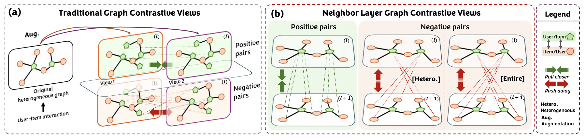








I am currently an PhD Student from the University of Hong Kong. My research interests include Recommendation, Data Privacy, Graph Learning, Self-supervised Learning, Computer Vision, and Federated Learning.

I look forward to collaborating in the field of Recommendation and Graph Learning.

I am also seeking self-motivated collaborators.

Feel free to contact me via <a href="mailto:jinfeng@connect.hku.hk">Email</a> or <a href="https://Jinfeng-Xu.github.io/images/WeChat.jpeg">WeChat</a>. 

<!-- 📄 You can download my CV <a href="assets/徐锦峰-CV.pdf" style="color: #0066cc; text-decoration: underline;" target="_blank">here</a>.-->

 <strong style="color: red">🌟 📢 PostDoc Opportunity</strong> 
I am looking for PostDoc opportunities in 26Fall related to Recommendation and Graph Learning, especially in labs based in the United States/Hong Kong/Singapore. My research interests include Recommendation System, Data Privacy, Graph Learning, Self-supervised Learning, Computer Vision, and Federated Learning. If our research interests align, please feel free to contact me via <a href="mailto:jinfeng@connect.hku.hk">Email</a> or <a href="https://Jinfeng-Xu.github.io/images/WeChat.jpeg">WeChat</a>.

# 🔥 News

<ul style="list-style-type: none; padding-left: 0; margin: 0;">
<li><em>2026.01:</em> 🎉 Two collaborative papers have been accepted by <strong>ICLR 2026</strong>. Congratulations to Jinze and Jianheng! 🎉
<li><em>2026.01:</em> 📚️ I serve as a reviewer for <strong>ICML 2026</strong>. </li>
<li><em>2026.01:</em> 📚️ I serve as a reviewer for <strong>IEEE Transactions on Pattern Analysis and Machine Intelligence (TPAMI)</strong>. </li>
<li><em>2025.12:</em> 📚️ I serve as a reviewer for <strong>Information Processing and Management (IPM)</strong>. </li>
<li><em>2025.12:</em> 🎉 One paper on group recommendation has been accepted by <strong>ACM Transactions on Information Systems (TOIS)</strong>. </li>
<li><em>2025.11:</em> 📚️ I serve as a reviewer for <strong>Neurocomputing (NEUCOM)</strong>. </li>
<li><em>2025.11:</em> 📚️ I serve as a reviewer for <strong>Pattern Recognition (PR)</strong>. </li>
<li><em>2025.11:</em> 🎉 Two papers on universal graph prompt tuning and mutlimodal recommendation have been accepted by <strong>KDD 2026</strong>. </li>
<li><em>2025.11:</em> 📚️ I serve as a reviewer for <strong>Kwowledge-Based System (KBS)</strong>. </li>
<li><em>2025.11:</em> 📚️ I serve as a reviewer for <strong>IEEE Wireless Communications (IEEE WCM)</strong>. </li>
<li><em>2025.11:</em> 📚️ I serve as a reviewer for <strong>WWW 2026 (Full, Short, Web4Good Tracks)</strong>. </li>
<li><em>2025.11:</em> 🎈 Honored to provide a presentation seminar at Hanyang University. Grateful to <strong>Prof. Sang-Wook Kim</strong> for the invitation! </li>
<li><em>2025.11:</em> 🎉 One paper on multimodal personalized clustering has been accepted by <strong>AAAI 2026</strong>. </li>
<li><em>2025.10:</em> 📚️ I serve as a reviewer for <strong>ICLR 2026</strong>. </li>
<li><em>2025.10:</em> 📚️ I serve as a reviewer for <strong>ACM Transactions on Knowledge Discovery from Data (ACM TKDD)</strong>. </li>
<li><em>2025.10:</em> 📚️ I serve as a reviewer for <strong>ACM Transactions on Internet Technology (ACM TOIT)</strong>. </li>
<li><em>2025.10:</em> 🌐 My new personal academic homepage is now online.</li>
<li><em>2023.09-2025.10:</em> 🎈 I have published more than 10 papers in top-tier conferences and journals as the first author, including 1 KDD, 2 SIGIR, 1 ACM MM, 1 RecSys (Spotlight Oral), 3 CIKM, 1 AAAI, 1 ICASSP, 1 TKDE, 1 TOIS, 1 TMM, and 1 Information Fusion. </li>
<li><em>2023.09-2025.10:</em> 🎈 I have also contributed as a co-author to many outstanding works, including NDSS, TDSC, KDD, IROS (Oral), etc. </li>
<li><em>2023.09-2025.10:</em> 📚️ I have served as a reviewer for over 10 top-tier conferences (e.g., ICLR, NeurIPS, KDD, SIGIR, etc.) and 5 top-tier journals (e.g., TKDE, TOIS, TII, TIT, etc.). Additionally, I was honored as an Outstanding Reviewer and invited as a Session Chair at KDD 2025. </li>

</ul>

 

# 📝 Selected Publications ([Full List](https://scholar.google.com/citations?user=-8eQo3UAAAAJ&hl=en))
**# indicates the authors with equal contributions, and * indicates the corresponding authors.**

<dl>
<dt>
TOIS 2025
</dt>
<dd><a href=""><strong>DGGVAE: Dual-Granularity Graph Variational Auto-Encoder for Group Recommendation</strong></a></dd>
<dd><strong>Jinfeng Xu</strong>, Zheyu Chen, Jinze Li, Shuo Yang, Wei Wang, Hewei Wang, Yijie Li, Xiping Hu, and Edith Ngai</dd>
<dd> ACM Transactions on Information Systems (<strong>TOIS</strong>), 2025</dd>
</dl>

<dl>
<dt>
KDD 2026
</dt>
<dd><a href=""><strong>Learning and Editing Universal Graph Prompt Tuning via Reinforcement Learning</strong></a></dd>
<dd><strong>Jinfeng Xu</strong>, Zheyu Chen, Shuo Yang, Jinze Li, Hewei Wang, Yijie Li, and Edith Ngai</dd>
<dd> ACM SIGKDD Conference on Knowledge Discovery and Data Mining (<strong>KDD</strong>), 2026</dd>
</dl>

<dl>
<dt>
KDD 2026
</dt>
<dd><a href=""><strong>VI-MMRec: Similarity-Aware Training Cost-free Virtual User-Item Interactions for Multimodal Recommendation</strong></a></dd>
<dd><strong>Jinfeng Xu</strong>, Zheyu Chen, Shuo Yang, Jinze Li, Zitong Wan, Hewei Wang, Weijie Liu, Yijie Li, and Edith Ngai</dd>
<dd> ACM SIGKDD Conference on Knowledge Discovery and Data Mining (<strong>KDD</strong>), 2026</dd>
</dl>

<dl>
<dt>
AAAI 2026
</dt>
<dd><a href="https://arxiv.org/pdf/2511.07274"><strong>Multi-modal Dynamic Proxy Learning for Personalized Multiple Clustering</strong></a></dd>
<dd><strong>Jinfeng Xu</strong>, Zheyu Chen, Shuo Yang, Jinze Li, Ziyue Peng, Zewei Liu, Hewei Wang, Jiayi Zhang, and Edith Ngai</dd>
<dd> The Association for the Advancement of Artificial Intelligence (<strong>AAAI</strong>), 2026</dd>
</dl>

<dl>
<dt>
TMM 2025
</dt>
<dd><a href="https://arxiv.org/pdf/2502.15711/"><strong>A Survey on Multimodal Recommender Systems: Recent Advances and Future Directions</strong></a></dd>
<dd><strong>Jinfeng Xu</strong>, Zheyu Chen, Shuo Yang, Jinze Li, Wei Wang, Xiping Hu, Steven Hoi, and Edith Ngai</dd>
<dd> IEEE Transactions on Multimedia (<strong>TMM</strong>), 2025</dd>
</dl>

<dl>
<dt>
TKDE 2025
</dt>
<dd><a href="https://ieeexplore.ieee.org/abstract/document/11154965/"><strong>Enhancing Robustness and Generalization Capability for Multimodal Recommender Systems via Sharpness-Aware Minimization</strong></a></dd>
<dd><strong>Jinfeng Xu</strong>, Zheyu Chen, Jinze Li, Shuo Yang, Wei Wang, Xiping Hu, Raymond Chi-Wing Wong, and Edith Ngai</dd>
<dd> IEEE Transactions on Knowledge and Data Engineering (<strong>TKDE</strong>), 2025</dd>
</dl>

<dl>
<dt>
CIKM 2025
</dt>
<dd><a href="https://arxiv.org/abs/2406.01034/"><strong>Enhancing Graph Collaborative Filtering with FourierKAN Feature Transformation</strong></a></dd>
<dd><strong>Jinfeng Xu</strong>, Zheyu Chen, Jinze Li, Shuo Yang, Wei Wang, Xiping Hu, and Edith Ngai</dd>
<dd> ACM International Conference on Information and Knowledge Management (<strong>CIKM</strong>), 2025</dd>
</dl>

<dl>
<dt>
CIKM 2025
</dt>
<dd><a href="https://arxiv.org/pdf/2508.10753/"><strong>Hypercomplex Prompt-aware Multimodal Recommendation</strong></a></dd>
<dd>Zheyu Chen #, <strong>Jinfeng Xu #</strong>, Hewei Wang, Shuo Yang, Zitong Wan and Haibo Hu</dd>
<dd> ACM International Conference on Information and Knowledge Management (<strong>CIKM</strong>), 2025</dd>
</dl>

<dl>
<dt>
ACM MM 2025
</dt>
<dd><a href="https://www.arxiv.org/pdf/2507.18489/"><strong>The Best is Yet to Come: Graph Convolution in the Testing Phase for Multimodal Recommendation</strong></a></dd>
<dd><strong>Jinfeng Xu</strong>, Zheyu Chen, Shuo Yang, Jinze Li, and Edith Ngai</dd>
<dd> ACM International Conference on Multimedia (<strong>ACM MM</strong>), 2025</dd>
</dl>

<dl>
<dt>
RecSys 2025 (Spotlight Oral)
</dt>
<dd><a href="https://arxiv.org/pdf/2507.07522/"><strong>NLGCL: Naturally Existing Neighbor Layers Graph Contrastive Learning for Recommendation</strong></a></dd>
<dd><strong>Jinfeng Xu</strong>, Zheyu Chen, Shuo Yang, Jinze Li, Hewei Wang, Wei Wang, Xiping Hu, and Edith Ngai</dd>
<dd> ACM Conference on Recommender Systems (<strong>RecSys</strong>), 2025</dd>
</dl>

<dl>
<dt>
KDD 2025
</dt>
<dd><a href="https://arxiv.org/pdf/2505.16665/"><strong>MDVT: Enhancing Multimodal Recommendation with Model-Agnostic Multimodal-Driven Virtual Triplets</strong></a></dd>
<dd><strong>Jinfeng Xu</strong>, Zheyu Chen, Jinze Li, Shuo Yang, Hewei Wang, Yijie Li, Mengran Li, Puzhen Wu, and Edith Ngai</dd>
<dd> ACM SIGKDD Conference on Knowledge Discovery and Data Mining (<strong>KDD</strong>), 2025</dd>
</dl>

<dl>
<dt>
SIGIR 2025
</dt>
<dd><a href="https://arxiv.org/pdf/2504.04452/"><strong>COHESION: Composite Graph Convolutional Network with Dual-Stage Fusion for Multimodal Recommendation</strong></a></dd>
<dd><strong>Jinfeng Xu</strong>, Zheyu Chen, Wei Wang, Xiping Hu, Sang-Wook Kim, and Edith Ngai</dd>
<dd> ACM International Conference on Research and Development in Information Retrieval (<strong>SIGIR</strong>), 2025</dd>
</dl>

<dl>
<dt>
SIGIR 2025
</dt>
<dd><a href="https://arxiv.org/pdf/2504.04443/"><strong>Squeeze and Excitation: A Weighted Graph Contrastive Learning for Collaborative Filtering</strong></a></dd>
<dd>Zheyu Chen, <strong>Jinfeng Xu  *</strong>, Yutong Wei, and Ziyue Peng</dd>
<dd> ACM International Conference on Research and Development in Information Retrieval (<strong>SIGIR</strong>), 2025</dd>
</dl>

<dl>
<dt>
AAAI 2025
</dt>
<dd><a href="https://arxiv.org/pdf/2402.19407/"><strong>MENTOR: Multi-level Self-supervised Learning for Multimodal Recommendation</strong></a></dd>
<dd><strong>Jinfeng Xu</strong>, Zheyu Chen, Shuo Yang, Jinze Li, Hewei Wang, and Edith Ngai</dd>
<dd> The Association for the Advancement of Artificial Intelligence (<strong>AAAI</strong>), 2025</dd>
</dl>

<dl>
<dt>
CIKM 2024
</dt>
<dd><a href="https://arxiv.org/pdf/2504.04452/"><strong>AlignGroup: Learning and Aligning Group Consensus with Member Preferences for Group Recommendation</strong></a></dd>
<dd><strong>Jinfeng Xu</strong>, Zheyu Chen, Jinze Li, Shuo Yang, Hewei Wang, and Edith Ngai</dd>
<dd>ACM International Conference on Information and Knowledge Management (<strong>CIKM</strong>), 2024</dd>
</dl>

# 🎖 Honors and Awards
- KDD'25 Outstanding Reviewer (Top 10%)

# 📖 Educations

 <strong>2023.09 - 2026.07 (Expected)</strong> 
 PhD, University of Hong Kong

 

# 🙌 Other
